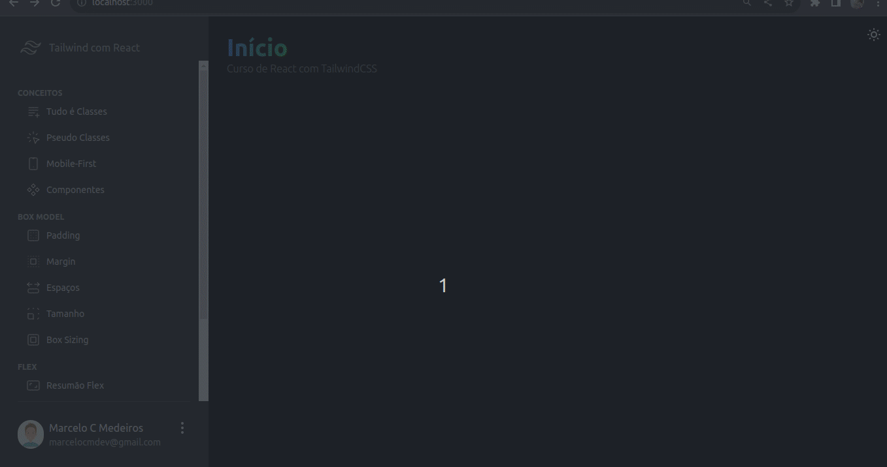

# Menu da Aplicação

<p align="center">
</img>
</img>
</p>

# Curso TailwindCSS com React

Curso trás os conceitos básicos e a importância de se usar o TailwindCSS.

## Neste Curso foi ensinado os seguintes temas: 


- **A filosofia do Tailwind**
- **Os principais conceitos do Tailwind: classes, mobile first, componentes e outros**
- **Box Model**: O modelo de caixa do HTML/CSS é um dos conceitos mais importantes para um desenvolvedor Web, por isso vamos entender como funciona no Tailwind.
- **Flexbox**: Vamos entender como usar flexbox com Tailwind em todos os projetos do curso. 
- **CSS Grid**: Exemplos de CSS Grid juntamente com Tailwind. Adicionalmente mostrar como criar um componente React chamado ```Grid``` que pode te ajudar muito no layout das tuas aplicações.
- **Extras**: tipografia, backgrounds e outros.
- **Menu da Aplicação**: Para finalizar foi construido um menu de uma aplicação e outros assuntos foram explorados como a alternância entre tema claro e escuro.


## 🤔 Segue abaixo como o projeto foi criado caso queira baixar e rodar no seu PC 
This is a [Next.js](https://nextjs.org/) project bootstrapped with [`create-next-app`](https://github.com/vercel/next.js/tree/canary/packages/create-next-app).

## Getting Started

First, run the development server:

```bash
npm run dev
# or
yarn dev
# or
pnpm dev
```

Open [http://localhost:3000](http://localhost:3000) with your browser to see the result.

You can start editing the page by modifying `pages/index.tsx`. The page auto-updates as you edit the file.

[API routes](https://nextjs.org/docs/api-routes/introduction) can be accessed on [http://localhost:3000/api/hello](http://localhost:3000/api/hello). This endpoint can be edited in `pages/api/hello.ts`.

The `pages/api` directory is mapped to `/api/*`. Files in this directory are treated as [API routes](https://nextjs.org/docs/api-routes/introduction) instead of React pages.

This project uses [`next/font`](https://nextjs.org/docs/basic-features/font-optimization) to automatically optimize and load Inter, a custom Google Font.

## Learn More

To learn more about Next.js, take a look at the following resources:

- [Next.js Documentation](https://nextjs.org/docs) - learn about Next.js features and API.
- [Learn Next.js](https://nextjs.org/learn) - an interactive Next.js tutorial.

You can check out [the Next.js GitHub repository](https://github.com/vercel/next.js/) - your feedback and contributions are welcome!

## Deploy on Vercel

The easiest way to deploy your Next.js app is to use the [Vercel Platform](https://vercel.com/new?utm_medium=default-template&filter=next.js&utm_source=create-next-app&utm_campaign=create-next-app-readme) from the creators of Next.js.

Check out our [Next.js deployment documentation](https://nextjs.org/docs/deployment) for more details.
